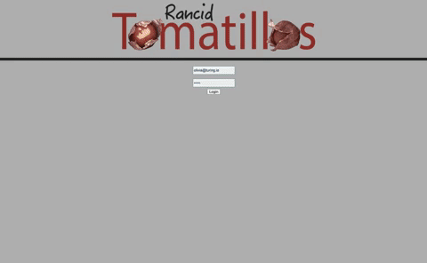
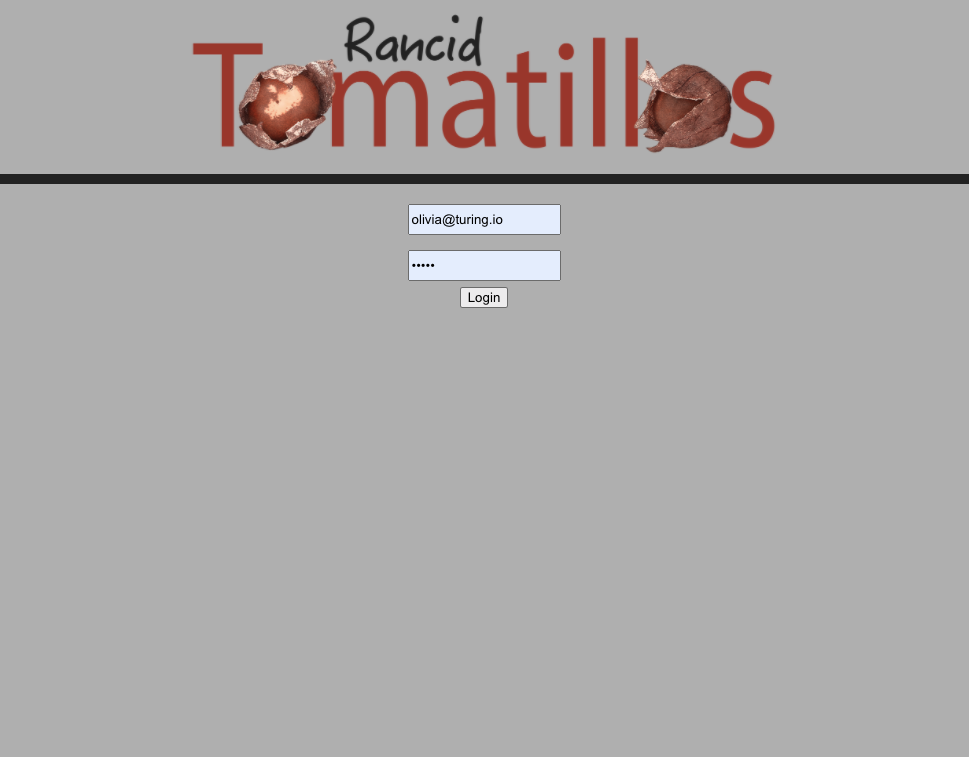
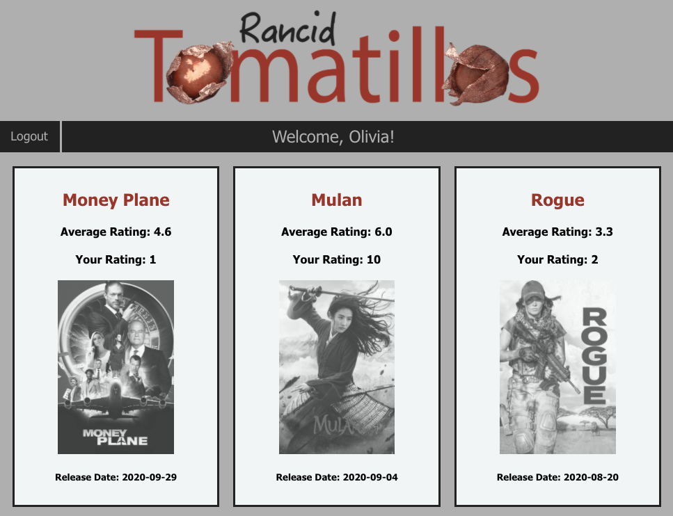
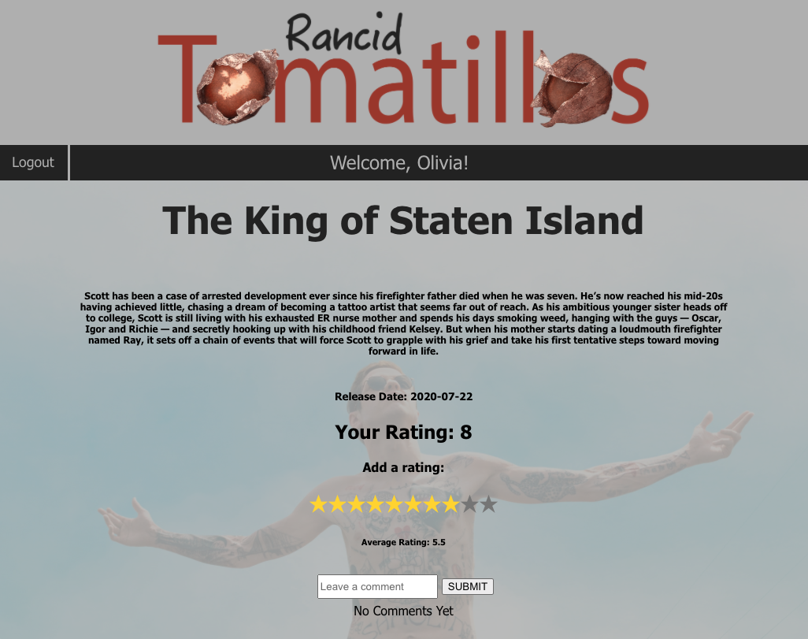
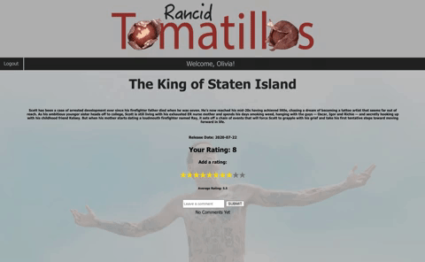

 

  
  <h3 align="center">Rancid Tomatillos</h3>
  

    A Turing School Mod 3 Paired Project
     
    <a href="https://github.com/aemcdonald/rancid-tomatillos-am-km"><strong>Repo Link</strong></a>
     
     
  

## About The Project
This was a pair project assigned during the first week of the third module of the Front-End Program at the Turing School of Software and Design. We achieved full functionality of the project spec with only two weeks of exposure to React.

The project reflects the functionality of familiar movie-rating applications. The application allows users to view movies fetched from an API, sign in and rate movies and leave comments on different movies of their choice.

The learning goals of this project included cementing fundamental concepts of React including architecting a React application from scratch, implementing class and functional components and utilizing React Router for path transitions and displays. Robust unit and integration testing was also implemented for each component utilizing the Jest testing suite.

### Built With
* JavaScript
* CSS/HTML
* React
* React Router
* Jest
* Babel
* Express

### Installation
In your terminal:
1. Clone the repo-
`git clone git@github.com:aemcdonald/rancid-tomatillos-am-km.git`
2. Install NPM packages- `npm install`
3. Start application- `npm start`
4. Enter user email- `olivia@turing.io`
5. Enter password- `pword`

## Usage
#### LOG-IN VIEW

#### HOMEPAGE VIEW

#### MOVIESHOW VIEW

#### MOVIESHOW FEATURES

## Roadmap
The total time allotted for this project was approximately two weeks. Future features contemplated by the developer include the following:

* Additional styling to the comments feature
* Feature for favoriting movies when a user is logged in
* Building an Express server from scratch (for comments and favorites)
* Deploying to Heroku

See the [open issues](https://github.com/aemcdonald/rancid-tomatillos-am-km/projects/1) for a list of proposed features (and known issues).

## Contact
[Kristi Miller - Developer](https://github.com/Kristiannmiller)

[Ashley McDonald - Developer](https://github.com/aemcdonald)

Project Link: [Rancid Tomatillos](https://github.com/aemcdonald/rancid-tomatillos-am-km)

## Acknowledgements
Leta Keane and Khalid Williams - The developers would like to thank the Turing Module 3 instructors for their assistance throughout this project and for their daily lessons on the magic of React.

Our Turing Mentors - Including Turing graduates Jon Sweet, Pol Sieira, Veronica Andrade and Aimee Fritz for their constant support throughout this project.
